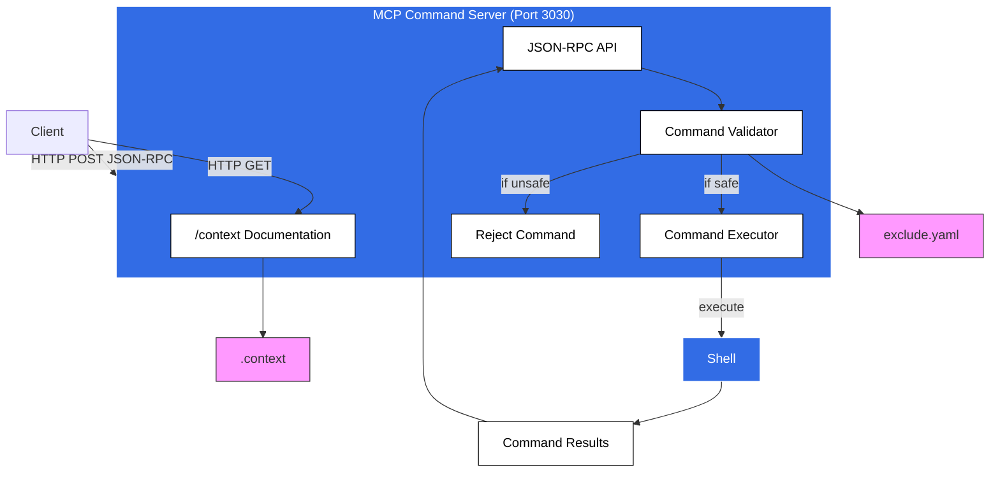
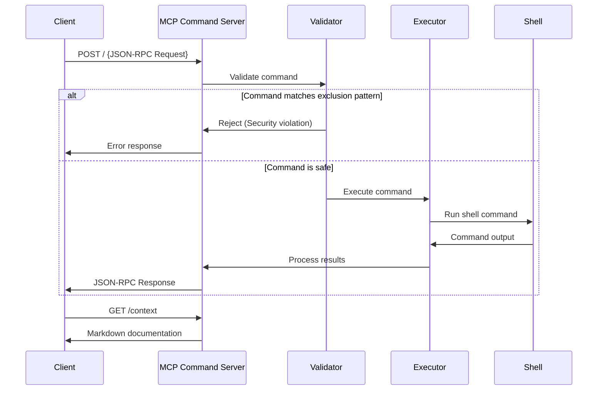
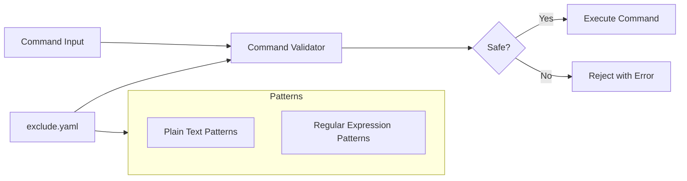

     <div align="center">

# MCP Command Server


**Secure JSON-RPC API for Remote Command Execution**

<p align="center">
  <a href="LICENSE"></a>
  <a href="https://www.rust-lang.org/"></a>
  <a href="docker-compose.yml"></a>
  <a href="https://www.jsonrpc.org/specification"></a>
</p>

<p align="center">
  MCP Command Server provides a secure, containerized interface for remote command execution with built-in pattern-based security validation, comprehensive API documentation, and enterprise-ready deployment configurations.
</p>

</div>

## 📋 Table of Contents

- [🔍 Overview](#-overview)
- [✨ Features](#-features)
- [🏗️ Architecture](#-architecture)
- [🚀 Installation](#-installation)
- [🧰 Usage](#-usage)
- [📚 API Documentation](#-api-documentation)
- [🔒 Security](#-security)
- [💻 Development](#-development)
- [🧪 Testing](#-testing)
- [👥 Contributing](#-contributing)
- [📄 License](#-license)

## 🔍 Overview

MCP Command Server provides a JSON-RPC 2.0 compliant API for executing shell commands on the server. It's designed with security in mind, featuring command pattern exclusion to prevent potentially harmful operations. The server is fully containerized with Docker and includes comprehensive API documentation accessible directly through the API.

## ✨ Features

- **JSON-RPC 2.0 API**: Standardized interface for command execution
- **Command Security**: Pattern-based command filtering to block potentially harmful operations
- **Self-Documenting**: Built-in `/context` endpoint serving markdown documentation
- **Containerized**: Ready-to-use Docker configuration
- **Production-Ready**: Security-focused design with non-root execution
- **Developer-Friendly**: Complete Postman collection for testing

## 🏗️ Architecture



### Component Flow



## 🚀 Installation

### Prerequisites

- Docker and Docker Compose
- Git (for cloning the repository)

### Using Docker (Recommended)

1. Clone the repository:
   ```bash
   git clone https://github.com/yourusername/mcp_command_server.git
   cd mcp_command_server
   ```

2. Start the server using Docker Compose:
   ```bash
   docker-compose up -d
   ```

3. The server will be available at `http://localhost:3030`

### Building from Source

1. Ensure you have Rust installed (1.74+ recommended):
   ```bash
   curl --proto '=https' --tlsv1.2 -sSf https://sh.rustup.rs | sh
   ```

2. Clone and build the project:
   ```bash
   git clone https://github.com/yourusername/mcp_command_server.git
   cd mcp_command_server
   cargo build --release
   ```

3. Run the server:
   ```bash
   ./target/release/mcp_command_server
   ```

## 🧰 Usage

### Basic Commands

Execute a simple command:

```bash
curl -X POST -H "Content-Type: application/json" -d '{
  "jsonrpc": "2.0",
  "id": 1,
  "method": "command/get",
  "params": {
    "command": "echo \"Hello World\""
  }
}' http://localhost:3030/
```

Response:
```json
{
  "jsonrpc": "2.0",
  "id": 1,
  "result": {
    "stdout": "Hello World\n"
  }
}
```

### Access API Documentation

Get the API documentation in markdown format:

```bash
curl http://localhost:3030/context
```

## 📚 API Documentation

The MCP Command Server provides comprehensive documentation via the `/context` endpoint. This documentation is served as markdown and includes:

- API overview
- Available methods
- Request/response formats
- Error codes
- Usage examples
- Security considerations

### JSON-RPC Specification

The API follows the JSON-RPC 2.0 specification:

- **Endpoint**: `http://localhost:3030/`
- **Method**: POST
- **Content-Type**: application/json
- **Body Format**:

```json
{
  "jsonrpc": "2.0",
  "id": "<unique_id>",
  "method": "command/get",
  "params": {
    "command": "<shell_command>"
  }
}
```

### Available Methods

| Method | Description | Parameters |
|--------|-------------|------------|
| `command/get` | Executes a shell command | `command`: string |

### Response Format

**Success Response:**
```json
{
  "jsonrpc": "2.0",
  "id": "<request_id>",
  "result": {
    "stdout": "<command_output>"
  }
}
```

**Error Response:**
```json
{
  "jsonrpc": "2.0",
  "id": "<request_id>",
  "error": {
    "code": "<error_code>",
    "message": "<error_message>"
  }
}
```

### Error Codes

| Code | Message | Description |
|------|---------|-------------|
| -32602 | Missing 'command' parameter | The required 'command' parameter was not provided |
| -32000 | Command execution error | The command could not be executed or was rejected |
| -32601 | Method not found | The specified method does not exist |

## 🔒 Security

The MCP Command Server implements several security measures:

### Command Exclusion System

The server uses a pattern-based exclusion system to prevent potentially harmful commands from being executed. This is configured through the `exclude.yaml` file, which contains:

- Plain text patterns (e.g., `rm -rf`, `sudo`, `apt`)
- Regular expression patterns (e.g., `regex:.*\.\.\/.*`)
- Options for case sensitivity and matching behavior



### Blocked Command Categories

The command exclusion system blocks several categories of potentially harmful commands:

- System modification (`apt`, `yum`, etc.)
- File deletion/modification (`rm -rf`, etc.)
- System control (`shutdown`, `reboot`, etc.)
- User/permission changes (`chmod`, `sudo`, etc.)
- Network operations (`wget`, `curl`, etc.)
- Command chaining to bypass filters (`&&`, `|`, etc.)
- Script execution (`bash`, `python`, etc.)
- Filesystem traversal (`../`, etc.)

### Docker Security

The server runs as a non-root user within the Docker container to limit potential damage from security breaches.

## 💻 Development

### Project Structure

```
mcp_command_server/
├── .context                 # API documentation markdown
├── Cargo.toml               # Rust dependencies
├── Dockerfile               # Multi-stage Docker build
├── exclude.yaml             # Command exclusion patterns
├── docker-compose.yml       # Docker Compose configuration
├── src/
│   ├── main.rs              # Main server code
│   ├── command.rs           # Command execution logic
│   ├── rpc.rs               # JSON-RPC handling
│   └── validator.rs         # Command validation logic
└── docs/
    ├── README.md            # Documentation for the Postman collection
    └── mcp_command_server.postman_collection.json  # Postman collection
```

### Dependencies

- **Rust**: Primary programming language
- **tokio**: Async runtime for Rust
- **warp**: Web server framework
- **serde** & **serde_json**: Serialization/deserialization
- **serde_yaml**: YAML parsing for exclusion patterns
- **regex**: Regular expression support for command validation

## 🧪 Testing

### Using the Postman Collection

A comprehensive Postman collection is included in the `docs/` directory for testing the API:

1. Import `docs/mcp_command_server.postman_collection.json` into Postman
2. Run individual requests or the entire collection
3. The collection includes tests for:
   - Basic commands
   - Error handling
   - Command execution
   - File operations
   - Security validation

### Manual Testing

Test basic functionality with curl:

```bash
# Test the context endpoint
curl http://localhost:3030/context

# Execute a simple command
curl -X POST -H "Content-Type: application/json" -d '{
  "jsonrpc": "2.0",
  "id": 1,
  "method": "command/get",
  "params": {
    "command": "echo \"Hello World\""
  }
}' http://localhost:3030/
```

## 👥 Contributing

Contributions are welcome! Please feel free to submit a Pull Request.

1. Fork the repository
2. Create your feature branch (`git checkout -b feature/amazing-feature`)
3. Commit your changes (`git commit -m 'Add some amazing feature'`)
4. Push to the branch (`git push origin feature/amazing-feature`)
5. Open a Pull Request

## 📄 License

This project is licensed under the MIT License - see the LICENSE file for details.

---

Built with ❤️ using Rust and Docker.
